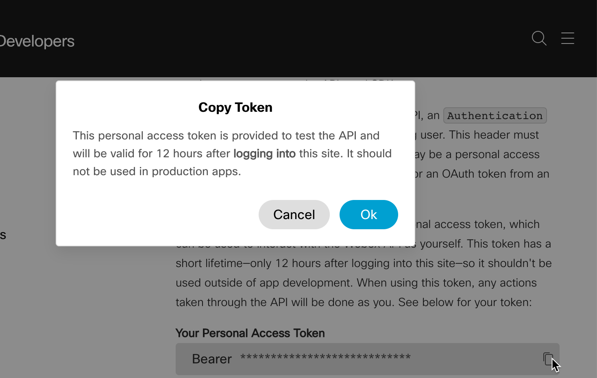
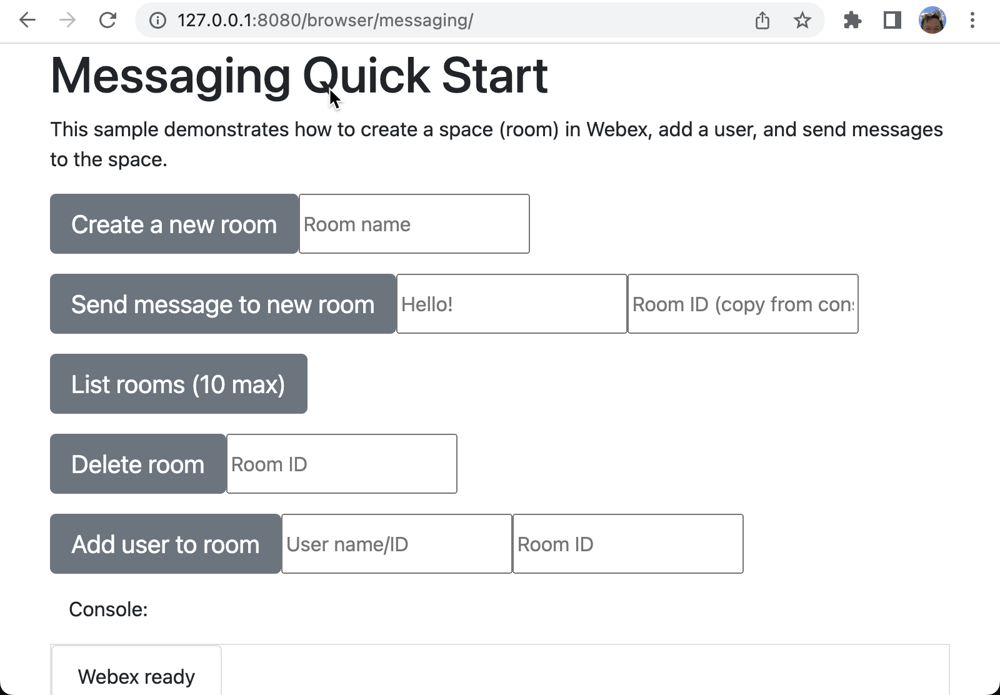

# Webex SDK Sample Apps

This repository contains Webex sample applications built with the [Webex SDKs](https://developer.webex.com/docs/sdks/browser).

## Authenticating with Webex APIs

These samples use your Webex personal access token to let you easily authenticate. To obtain your access token login to the [Developer Portal](https://developer.webex.com/login), then open the [Getting Started](https://developer.webex.com/docs/getting-started#accounts-and-authentication) guide. Under **Your Personal Access Token** click the copy icon, then click **OK** in the pop-up dialog to copy your access token to the clipboard.



To use your access token with a given sample app, open the app's index.js page and paste the value from your clipboard as the value of the `personal_access_token` variable.

```javascript
var personal_access_token = "<your_access_token>"
```

## Running the Browser SDK Sample Apps

You can run the Browser SDK samples apps from any web server, running locally or remote. For example, you can install the `live-server` using `npm`:

```bash
npm install live-server -g 
```

And then run the server:

```bash
cd ~/GitHub/sdk-samples/browser
live-server
Serving "/GitHub/sdk-samples" at http://127.0.0.1:8080
```

Open the browser at the specified URL and navigate to the folder containing the desired sample app.


### Browser 

