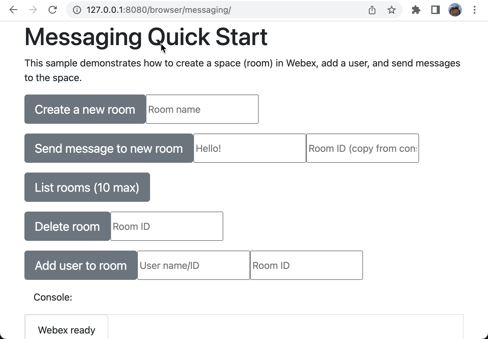

# Browser SDK Messaging Sample App

This application demonstrates using the Browser SDK to do the following:

* Create a room (space)
* Send a message to a room
* List rooms
* Add a user to a room
* Delete a room

